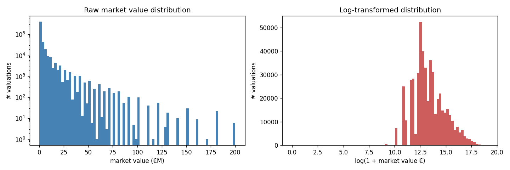
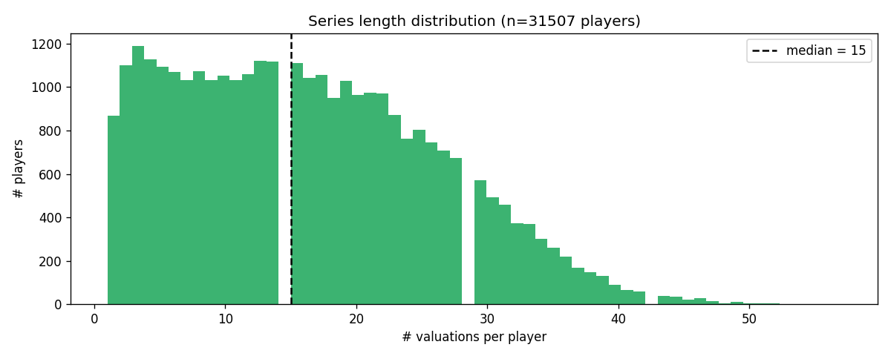
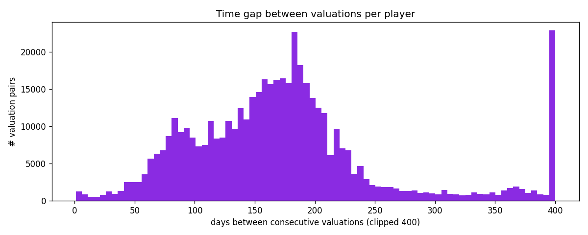
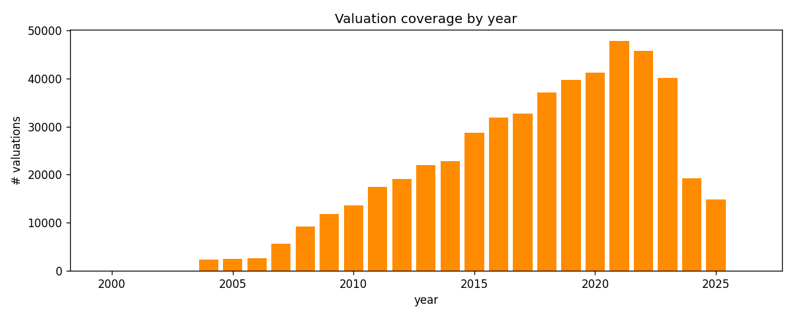
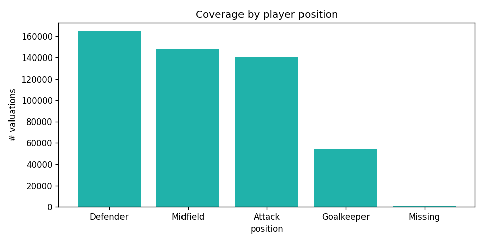
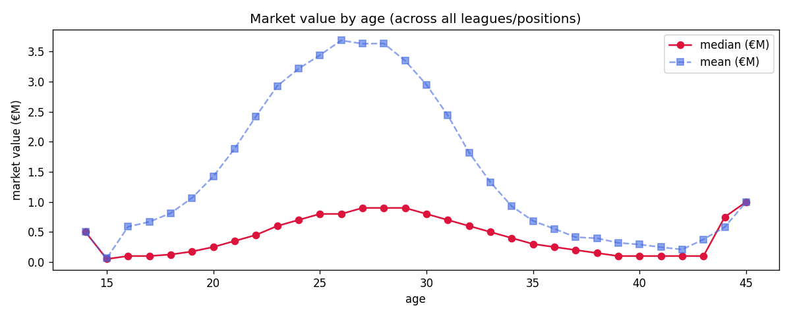
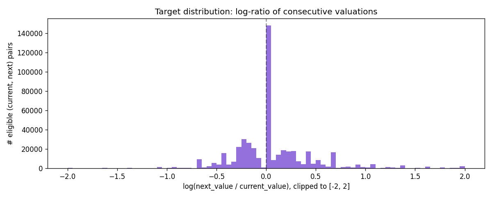

# EDA — Transfermarkt player valuations

_Generated by `scripts/eda.py` over the Kaggle dump._

## 1. Value distribution

- N valuations: **507,815**
- Range: €0 → €200,000,000
- p50 / p99: €500,000 / €35,000,000
- Skew (raw)  : **7.92**  ⇒ raw values are extremely right-skewed.
- Skew (log1p): **0.42**  ⇒ log transform fixes the skew.

## 2. Series length per player

- 31,507 unique players with valuations
- median series length: **15** points
- p25 / p75 / p95: 8 / 23 / 34
- max: 57
- players with < 3 points: **6.3%** (cold-start problem)
- players with < 5 points: **13.6%**

## 3. Time between consecutive valuations

- p25 / p50 / p75 days: 121 / 168 / 203
- share with gap > 365d: **6.4%**
- Average gap: ~189 days  ⇒ updates are roughly twice a year.

## 4. Coverage by year

- Range: **2000 – 2026**
- Coverage grew massively after ~2010 — earlier years are sparse.

## 5. Coverage by position

- Defender: 164,648
- Midfield: 147,633
- Attack: 140,663
- Goalkeeper: 54,065
- Missing: 806

## 6. Value vs age

Players typically peak in value around age 24–27, then decline.

## 7. Target distribution — log-ratio of consecutive valuations

- Eligible (current, next) pairs: **476,306**
- Mean log-ratio: +0.063
- Median log-ratio: +0.000
- Std log-ratio: 0.431
- Share gain (>0): **35.0%**
- Share flat (|·|<0.05): 31.3%
- Share drop (<0): **34.2%**

## Implications for modeling

- **Target**: predict `log(value_T+H / value_T)`, NOT raw €. The raw
  distribution is too skewed; log fixes it.
- **Cold start matters**: ~6% of players have < 3 valuations.
  Sequence models will be useless on these; tabular ML must handle them.
- **Series are short and irregular**: median 15 points, ~189 days apart.
  Don't expect classical AutoARIMA to work brilliantly — too few points.
- **Class imbalance**: more 'flat' and 'gain' pairs than 'drop' — model
  could trivially bias toward predicting non-negative ratios.